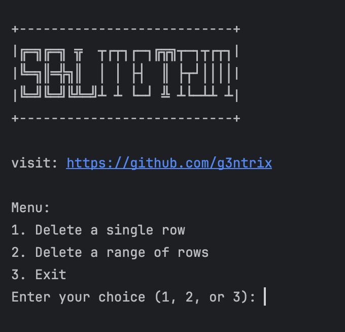

# SQLiteTrim

**SQLiteTrim** is a simple Python tool to delete specific rows or ranges of rows from an SQLite database and renumber the remaining rows sequentially, ensuring data consistency and order. This tool is particularly useful for x-ui SQLite databases, maintaining correct IDs for seamless user creation.

## Features

- Interactive Menu: Provides a user-friendly interface to select deletion options.
- Single Row Deletion: Delete a specific row by its ID.
- Range Deletion: Delete a range of rows by specifying start and end IDs.
- Sequential Renumbering: Automatically renumbers remaining rows to maintain sequential order.
- Safe Operations: Modifies a copy of the original database to ensure data safety.

## Usage

1. **Clone the Repository**:
    ```sh
    git clone https://github.com/g3ntrix/SQLiteTrim.git
    cd SQLiteTrim
    ```

2. **Run the Script**:
    ```sh
    python sqlite_trim.py
    ```

3. **Follow the Interactive Prompts**:
    - Choose to delete a single row or a range of rows.
    - Enter the ID(s) as prompted.
    - The modified database will be saved with a new name, preserving the original file.

## Important Notes

1. **Backup your data** before using this tool. SQLiteTrim is in the early phase of development and may contain bugs.
2. Ensure that the `x-ui.db` file is named exactly as `x-ui.db` and placed in the directory where you run the tool.

## Screenshot



## Requirements

- Python 3.x
- SQLite3

## License

This project is licensed under the MIT License - see the [LICENSE](LICENSE) file for details.

## Contributing

Contributions are welcome! Please fork the repository and submit pull requests for any features, bug fixes, or improvements.

## Acknowledgements

Developed by [g3ntrix](https://github.com/g3ntrix).
