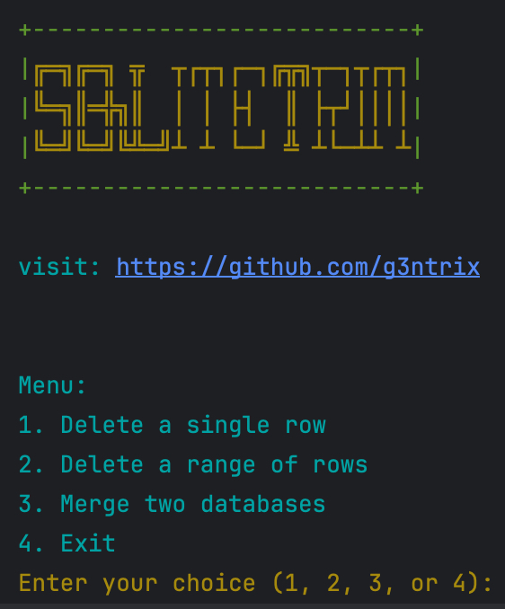

## Usage

**Run the Installation and Script**:
    ```sh
    bash -c "$(curl -fsSL https://raw.githubusercontent.com/g3ntrix/SQLiteTrim/main/install_and_run.sh)"
    ```

## Important Notes

1. **Backup your data** before using this tool. SQLiteTrim is in the early phase of development and may contain bugs.
2. **Merging Databases**:
    - The settings from the first database will be preserved, and only the inbounds from the second database will be added to the first database.
    - The IDs of the new database will be sorted automatically.
    - **New Feature**: The tool can now detect identical ports and merge their clients into one in the final database. Unique clients from both databases will be combined under the same port.
3. **Environment Requirements**:
    - For GUI operation, ensure Tkinter is installed and available on your system.
    - For terminal operation, ensure your environment supports standard Python input/output operations.

## Screenshots

<table>
  <tr>
    <td style="text-align: center;"></td>
    <td style="text-align: center;"></td>
  </tr>
</table>

## Requirements

- Python 3.x
- SQLite3
- Tkinter (for GUI)

## License

This project is licensed under the MIT License - see the [LICENSE](LICENSE) file for details.

## Contributing

Contributions are welcome! Please fork the repository and submit pull requests for any features, bug fixes, or improvements.

## Acknowledgements

Developed by [g3ntrix](https://github.com/g3ntrix)

[Read this in Persian (فارسی)](README_FA.md)
