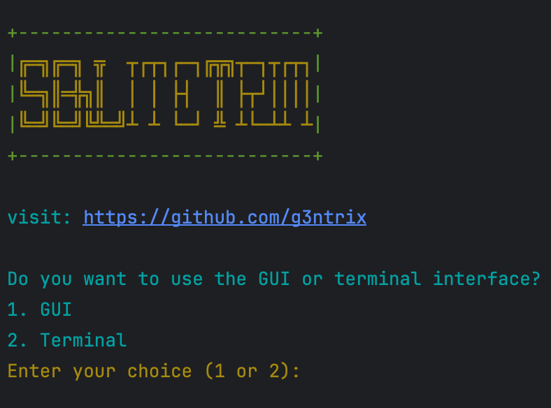

## نحوه استفاده

1. **نصب و اجرای اسکریپت**:
    ```sh
    bash -c "$(curl -fsSL https://raw.githubusercontent.com/g3ntrix/SQLiteTrim/main/install_and_run.sh)"
    ```

## نکات مهم

1. **قبل از استفاده، از داده‌هاتون پشتیبان بگیرین**. SQLiteTrim هنوز در مراحل اولیه توسعه‌ست و ممکنه باگ داشته باشه.
2. **ادغام دیتابیس‌ها**:
    - وقتی دو تا دیتابیس رو ادغام می‌کنین، مطمئن بشین که پورت‌های مشابهی توی هر دو دیتابیس وجود نداره، وگرنه دیتابیس xray راه نمی‌افته مگر اینکه دستی اون پورت‌های مشابه رو حذف کنین.
    - تنظیمات از دیتابیس اول حفظ می‌شه و فقط inbounds از دیتابیس دوم به دیتابیس اول اضافه می‌شه.
    - شناسه‌های دیتابیس جدید به صورت خودکار مرتب می‌شن.
    - **ویژگی جدید**: ابزار حالا می‌تونه پورت‌های مشابه رو شناسایی کنه و کلاینت‌های اون‌ها رو توی دیتابیس نهایی ادغام کنه. کلاینت‌های منحصربه‌فرد از هر دو دیتابیس زیر یک پورت ترکیب می‌شن.

## نیازمندی‌های محیط

1. **برای استفاده از رابط گرافیکی**، مطمئن بشین Tkinter روی سیستم‌تون نصب شده و قابل استفاده‌ست.
2. **برای استفاده در ترمینال**، مطمئن بشین محیط شما از عملیات استاندارد ورودی/خروجی پایتون پشتیبانی می‌کنه.

## اسکرین‌شات‌ها

<table>
  <tr>
    <td style="text-align: center;"></td>
    <td style="text-align: center;"></td>
  </tr>
</table>

## نیازمندی‌ها

- پایتون نسخه 3 به بالا
- SQLite3
- Tkinter (برای رابط گرافیکی)

## لایسنس

این پروژه تحت لایسنس MIT منتشر شده. برای جزئیات بیشتر فایل [LICENSE](LICENSE) رو ببینین.

## همکاری

همکاری شما رو با آغوش باز می‌پذیریم! لطفاً ریپوزیتوری رو فورک کنین و درخواست کش برای هر ویژگی، رفع باگ یا بهبود رو ارسال کنین.

## قدردانی

توسعه داده شده توسط [g3ntrix](https://github.com/g3ntrix)

[Read this in English](README.md)
